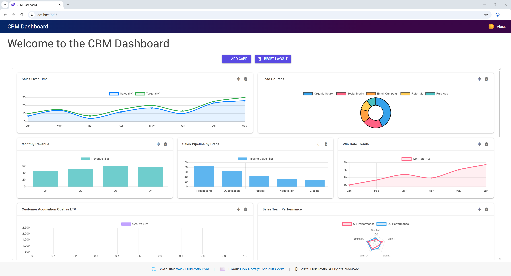

# CRM Dashboard Blazor WebAssembly


## ?? Modern CRM Dashboard
A feature-rich, responsive CRM dashboard built with **Blazor WebAssembly** and **MudBlazor**. Visualize sales, leads, KPIs, and more with interactive charts and a customizable layout.

---

## ? Features
- ?? Interactive, drag-and-drop dashboard cards
- ?? Real-time charts and KPIs
- ?? Light/Dark mode toggle
- ?? Modular, extensible component design
- ?? Persistent layout with local storage
- ?? Built with .NET 9 and Blazor WebAssembly

---

## ??? Demo


> _Add a live demo link or animated GIF here if available._

---

## ??? Getting Started

1. **Clone the repository:**
   ```bash
   git clone https://github.com/DonPotts/CRM-Dashboard-Blazor.git
   cd CRM-Dashboard-Blazor
   ```
2. **Run the app:**
   ```bash
   dotnet run --project DashboardTestApp/DashboardTestApp.csproj
   ```
3. **Open in browser:**
   Visit `https://localhost:5001` (or the URL shown in your terminal)

---

## ?? Technologies Used
- [Blazor WebAssembly](https://dotnet.microsoft.com/apps/aspnet/web-apps/blazor)
- [MudBlazor](https://mudblazor.com/)
- [C# 13 / .NET 9](https://dotnet.microsoft.com/)
- [Chart.js (via JS interop)](https://www.chartjs.org/)

---

## ?? Screenshots
| Dashboard (Light) | Dashboard (Dark) |
|------------------|------------------|
|  |  |

---

## ?? Contact
- ?? [www.DonPotts.com](https://www.DonPotts.com)
- ?? [Don.Potts@DonPotts.com](mailto:Don.Potts@DonPotts.com)
